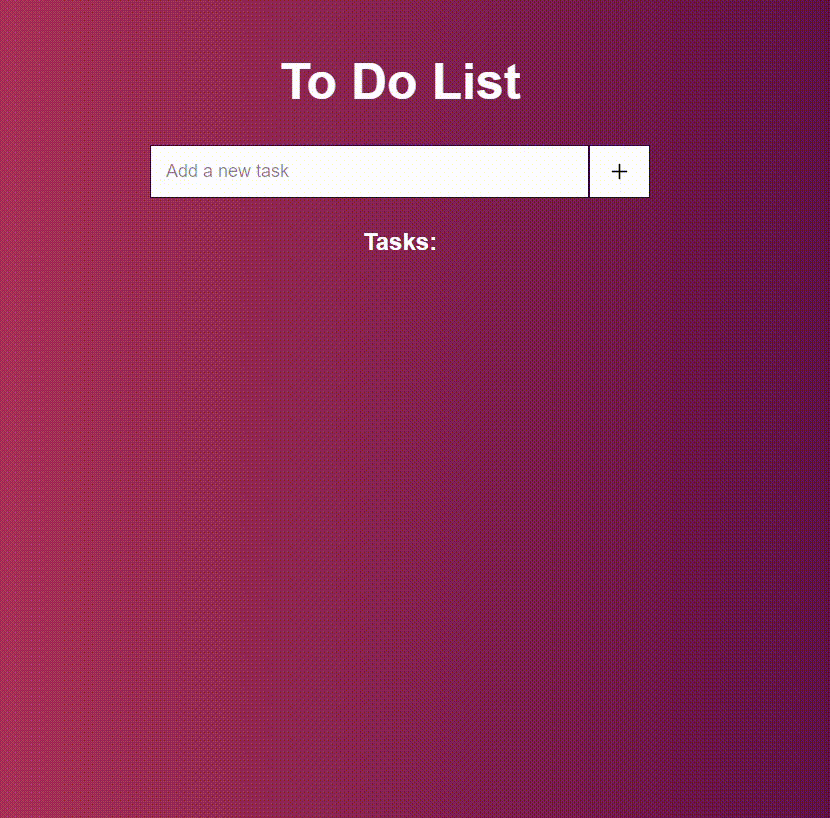

# To-do List application using JavaScript

## Project 💻
This was my first project using JavaScript. That "To-Do List" was created using only HTML, CSS and JavaScript.    

 
 

## How it works 

   

 
 
## Technologies 

- [HTML](./praticando.html)
- [CSS](./css/style.css)
- [JavaScript](./js/script.js)

*To see how the application was built, click in on of the links above*

 
 

## Build and Run 🚀
To access the application, go this way --> 